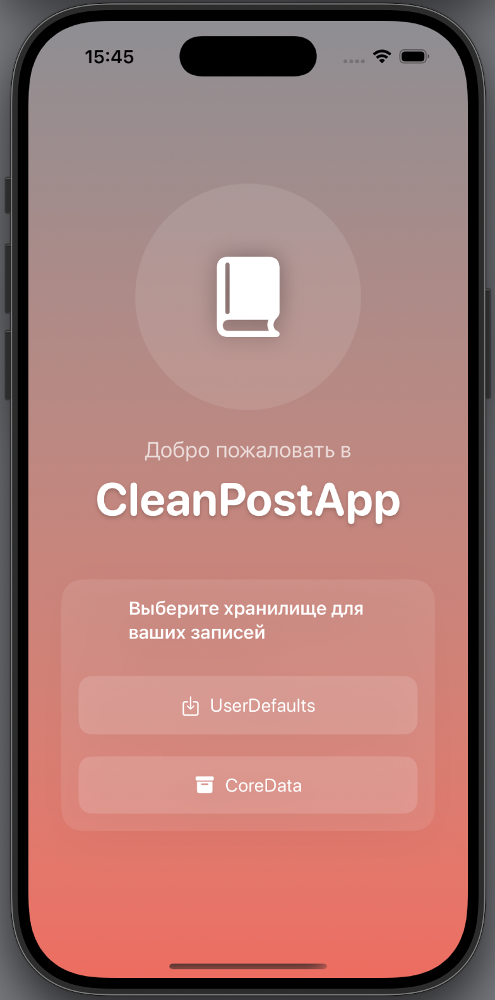
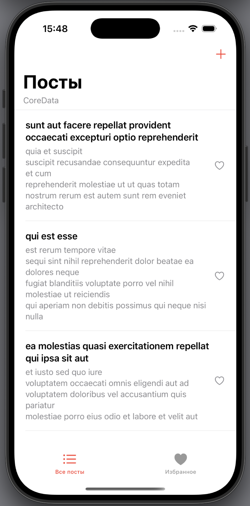
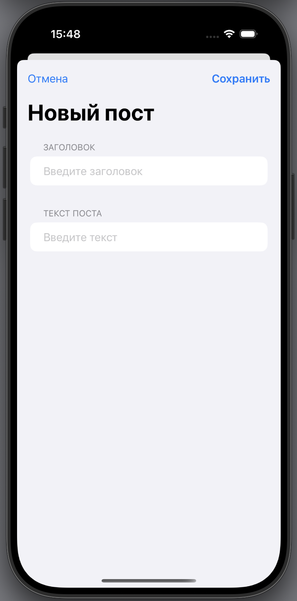
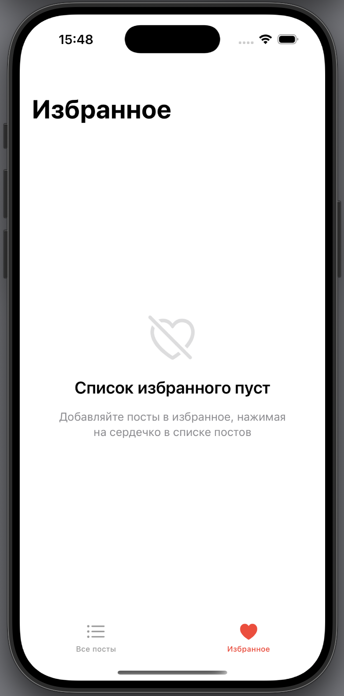

# 📱 CleanPostApp

**CleanPostApp** — это лёгкое и современное iOS-приложение для просмотра и управления постами, с возможностью офлайн-режима и выбора хранилища данных: `UserDefaults` или `CoreData`.

---

## 🚀 Основной функционал

- Загрузка постов с сервера (https://jsonplaceholder.typicode.com)
- Отображение постов в виде списка
- Пагинация (постраничная подгрузка)
- Избранные посты (состояние сохраняется)
- Удаление пользовательских постов
- Добавление собственных постов
- Поддержка офлайн-режима (локальный кэш)
- Информирование пользователя об ошибках и состоянии соединения
- Выбор хранилища (`UserDefaults` или `CoreData`) при запуске
- Интерфейс в соответствии с [Human Interface Guidelines (HIG)](https://developer.apple.com/design/human-interface-guidelines/)

---

## 🧱 Архитектура

- **MVVM**: чёткое разделение логики, хранения и представления
- **Combine**: реактивное управление состоянием и сетевыми событиями
- **Протоколы**: гибкость и тестируемость (`PostStorageProtocol`, `NetworkServiceProtocol`)
- **Mock-сервисы**: для написания юнит-тестов без подключения к API

---

## 🗂 Структура проекта

- `AppRootView.swift`
- `Views/`
  - `Posts/`
    - `PostsListView.swift`
    - `AddPostView.swift`
    - `PostRowView.swift`
  - `Favorites/`
    - `FavoritesView.swift`
  - `Welcome/`
    - `WelcomeView.swift`
    - `StorageSelectionCard.swift`
    - `AnimatedGradient.swift`
    - `JournalLogoView.swift`
  - `Main/`
    - `MainTabView.swift`
- `ViewModels/`
  - `PostsViewModel.swift`
- `Models/`
  - `Post.swift`
  - `StorageType.swift`
- `Networking/`
  - `NetworkService.swift`
- `Storage/`
  - `UserDefaultsStorage.swift`
  - `FavoritesStorage.swift`
  - `PostStorageProtocol.swift`
  - `CoreData/`
    - `CoreDataManager.swift`
    - `CoreDataStorage.swift`
    - `CDPost+CoreDataClass.swift`
    - `CDPost+CoreDataProperties.swift`
- `Factory/`
  - `ViewModelFactory.swift`
- `Supporting/`
  - `AppData.swift`
  - `CleanPostAppApp.swift`
  - `Color.swift`
  - `Assets.xcassets/`
- `Tests/`
  - `PostsViewModelTests.swift`
  - `MockNetworkService.swift`
  - `MockPostStorage.swift`
  - `CleanPostAppTests.swift`
- `TestTask/`
  - `test-task.pdf`
- `.gitignore`
- `README.md`

---

## 📸 Скриншоты

| Экран приветствия | Список постов |
|-------------------|----------------|
|  |  |

| Новый пост | Избранное |
|------------|-------------|
|  |  |

---

## 🧪 Тестирование

- Покрытие базовой бизнес-логики (`PostsViewModel`)
- Используются: `XCTest`, `Combine`, `MockNetworkService`, `MockPostStorage`

---

## 🧭 Возможные доработки

- Детальный экран поста
- Редактирование пользовательских постов
- Подключение авторизации
- Отображение даты / пользователя
- Экспорт и импорт данных

---

## 📎 Приложение тестового задания

Файл `TestTask/test-task.pdf` — оригинальное условие задания, на основе которого реализовано приложение.

---

## 📝 Автор

**Ekaterina Saveleva**  
Разработка и дизайн: 100%  
Тесты, архитектура, README — авторские 
[iOS-разработчик и преподаватель](https://t.me/indiana_jonez)  
2025 © Все права защищены

